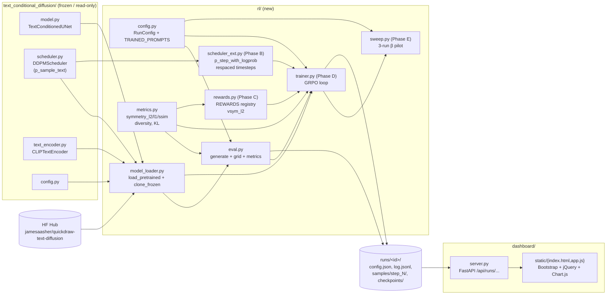
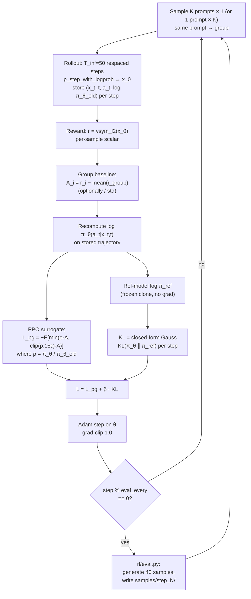
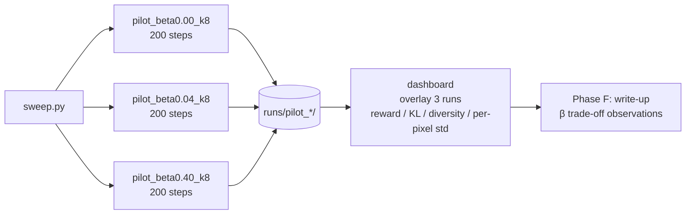

# RL-for-Diffusion: How the pieces fit together

## 1. Code & data dependencies (modules)



## 2. Per-step GRPO training loop (runtime)



## 3. β-pilot orchestration (Phase E)



## 4. On-disk contract per run

```
runs/<run_id>/
├── config.json              # RunConfig snapshot
├── log.jsonl                # one row per training step
│                            # {step, reward_mean, kl_to_ref, loss_pg, loss_kl, grad_norm, lr}
├── checkpoints/
│   └── step_<N>.pt          # policy weights (optional, periodic)
├── samples/
│   └── step_<N>/
│       ├── grid.png         # 5 prompts × 8 seeds composite
│       ├── manifest.json    # rows=prompts, cols=seeds, tile_size
│       └── metrics.json     # symmetry_l2/l1/ssim_mean + by_prompt, diversity, per_pixel_std
└── final_metrics.json
```
