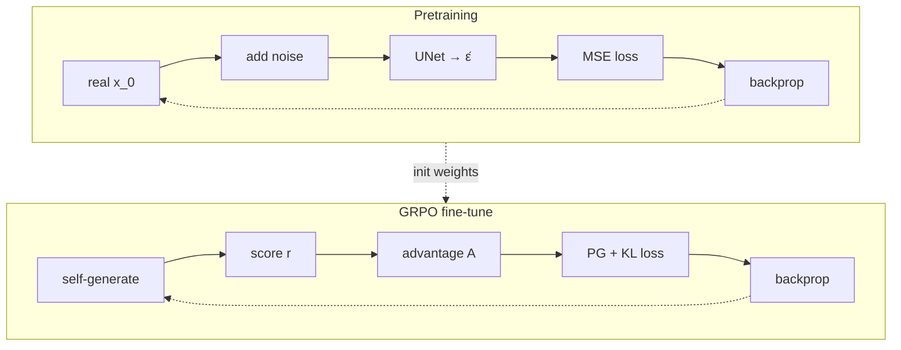
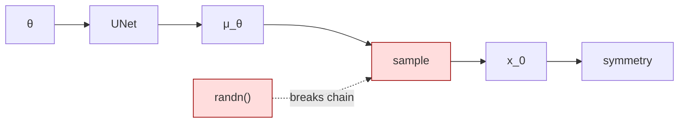
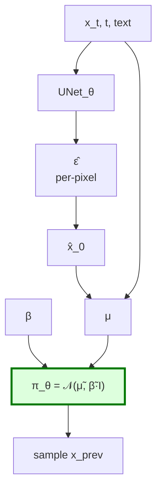
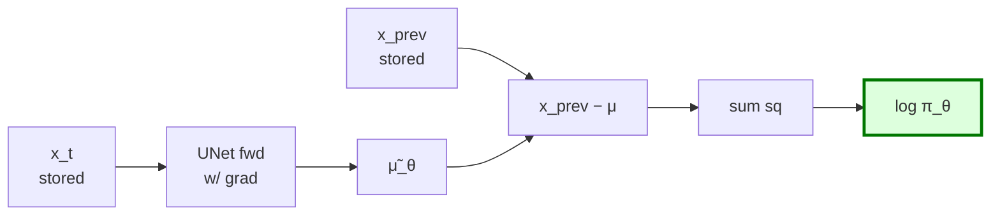
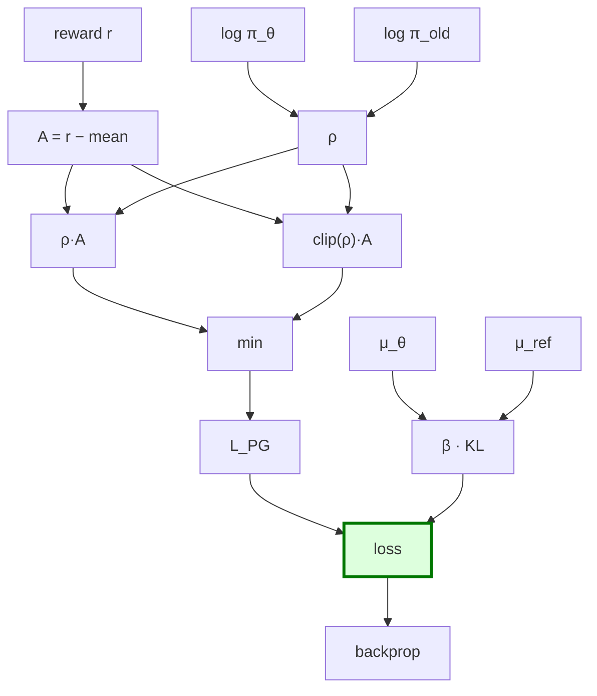
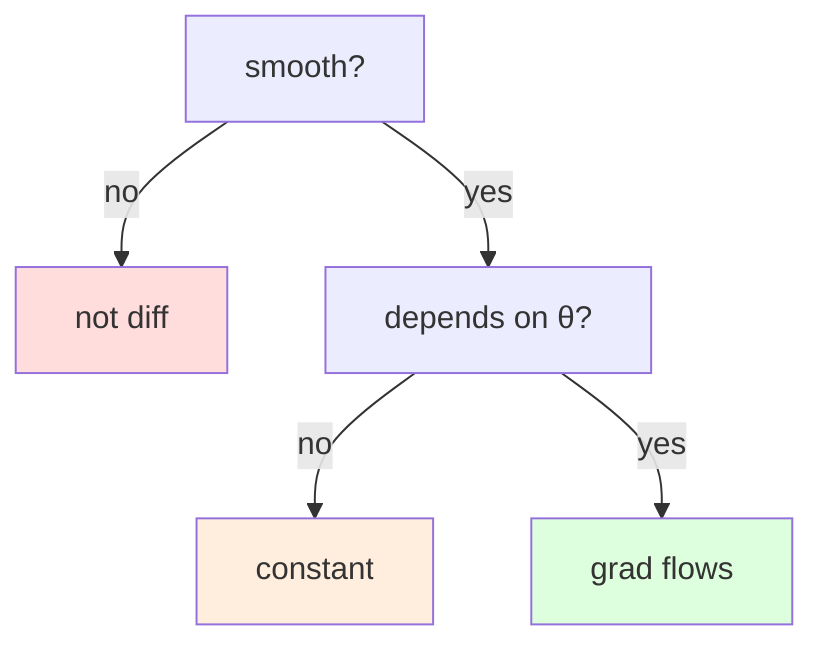
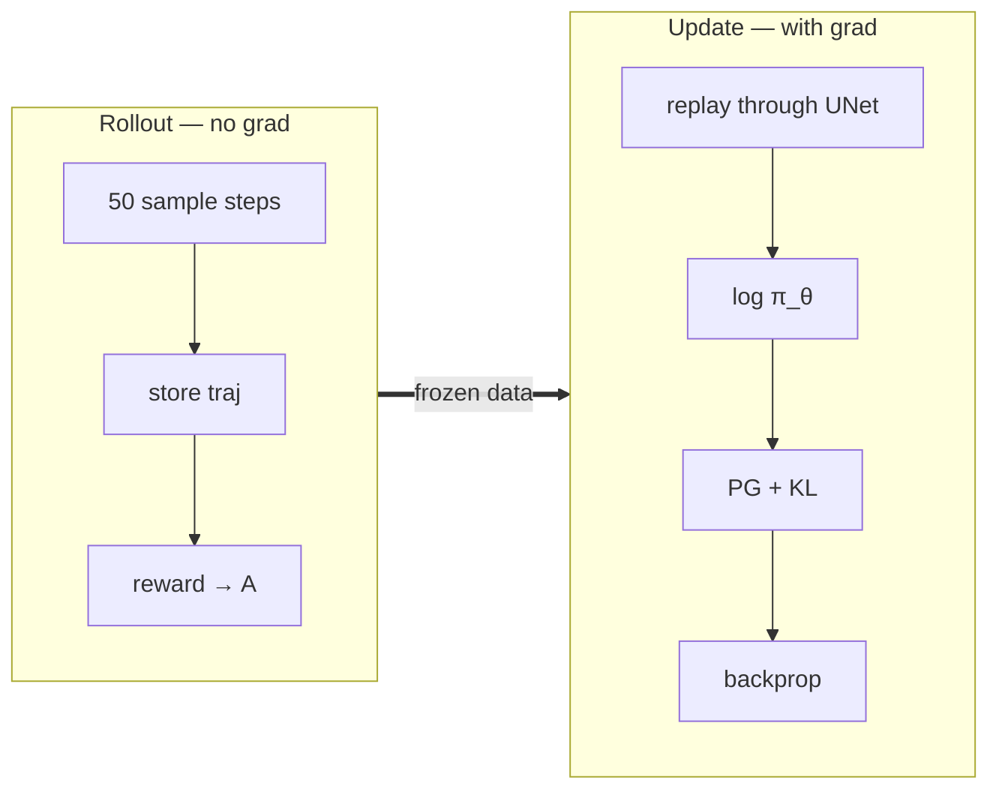

# What we learned in this session

Built up from "where does GRPO fit?" to "the policy *is* the per-pixel Gaussian."

---

## 1. Pretraining vs GRPO — same net, different loop

Same UNet, same backprop, same optimizer. **Only the loss formula changes.**

---

## 2. Why we can't backprop through symmetry

`randn()` is not a function of θ. Chain rule stops there. → use policy gradients instead.

---

## 3. The policy = per-pixel Gaussian

UNet → per-pixel noise. Scheduler → per-pixel mean. **That Gaussian is the policy.**

---

## 4. How log π_θ(action) is computed

Scaled negative MSE between action and predicted mean. **Differentiable in θ.**

---

## 5. The GRPO loss

PG term + KL anchor. Clip caps per-step jumps; KL caps long-term drift.

---

## 6. What's differentiable?

Dice rolls fail **Q2**, not Q1.

- **not diff**: argmax, if, round, discrete sample
- **constant**: stored tensors, rewards, randn output
- **grad flows**: UNet, μ_θ, log π_θ, KL

---

## 7. Full GRPO step

Rollout = make data. Update = feed back, weight by advantage, backprop.

---

## TL;DR

| Concept | Resolution |
|---|---|
| GRPO vs pretraining | Same net + backprop, different scalar |
| Why not `-symmetry().backward()`? | randn breaks the gradient chain |
| What's the policy? | Per-pixel Gaussian the UNet+scheduler defines |
| What's P(action)? | Density of that Gaussian at the sampled image |
| UNet output? | Per-pixel unit-variance noise tensor |
| Noise → Gaussian? | Scheduler arithmetic, no learning |
| Where does gradient flow? | μ̃_θ → log π_θ → ρ → loss |
